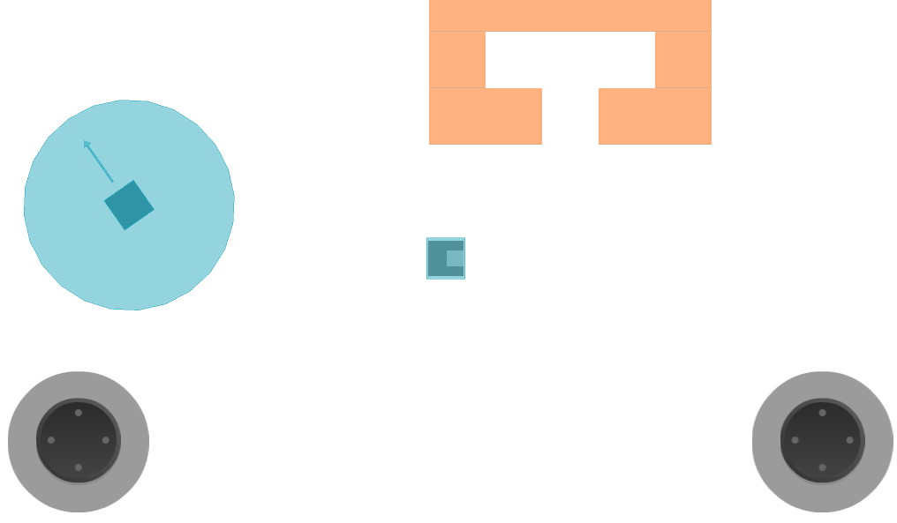

# rimz
Open source game inspired by rimworld. Powered by Godot Engine. Target platform is android.
### TO DO

- [x] Inventory system
- [x] Entity base class
- [x] Player and android joystick to control its moving
- [x] Dialogue system
- [x] Saving and loading
- [ ] Astar algorithm
- [ ] Enemy behaviour
- [ ] Skill system
- [ ] Build system
- [ ] Neutral being behaviour
- [ ] Procedure generation

